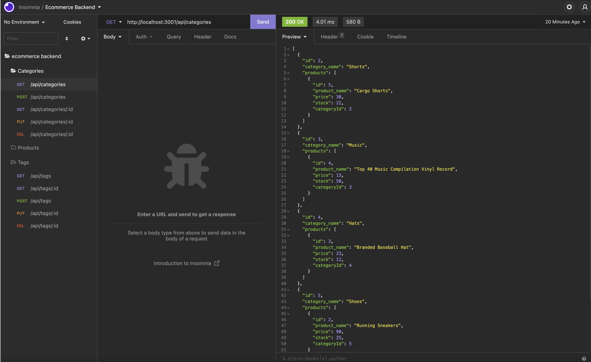

# E-Commerce Backend: Sequelize

## Description

This application creates a server and a database using express.js for the server, and sequelize.js/mysql2.js to interact with the MySQL database. I tested all of the routes with insomnia, giving the database complete CRUD functionality. I used the dotenv module to increase security and allow the app to access the .env file. I learned how to create sequelize routes, models, and associations. 
## Installation

1. Clone the repo found at this link: [https://github.com/brownj47/ecommerce-backend-sequelize](https://github.com/brownj47/ecommerce-backend-sequelize)
2. Install MySQL following this guide: [https://coding-boot-camp.github.io/full-stack/mysql/mysql-installation-guide](https://coding-boot-camp.github.io/full-stack/mysql/mysql-installation-guide)
3. Run the command 'mysql -u root -p' in the terminal while in the root directory of the cloned repo to open mysql.
4. Run 'SOURCE db/schema.sql;' to create the data structure for your application.
5. Run the command 'exit;' to exit mysql.
6. Run npm i to install the node modules.
7. Rename the file '.env.example' to '.env', and fill the enclosed fields with the password you set for MySQL.
8. Run 'npm run seed' to seed the database.

See this link for a detailed video walkthrough: https://drive.google.com/file/d/1hdUgp4vxri3koYUd1ZOdCmYGXEJ0Yc-h/view

## Usage

Run 'npm start' or 'node server.js' to start the server. 
Then drag and drop the insomnia.json file found in the root directory fo the project into an insomnia collection and it should import, allowing you to run and test all of the routes on the server. 

